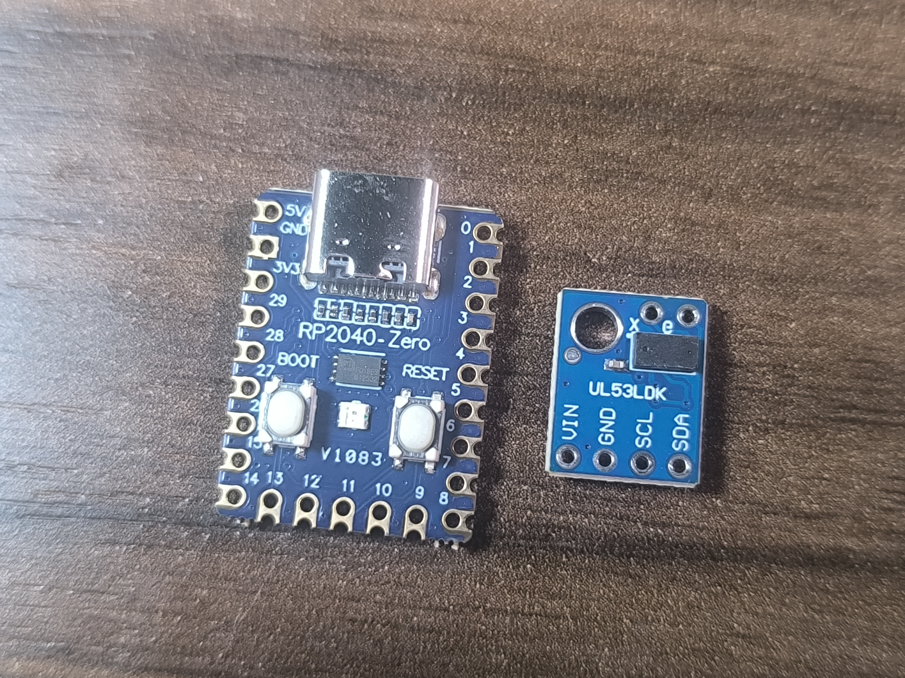
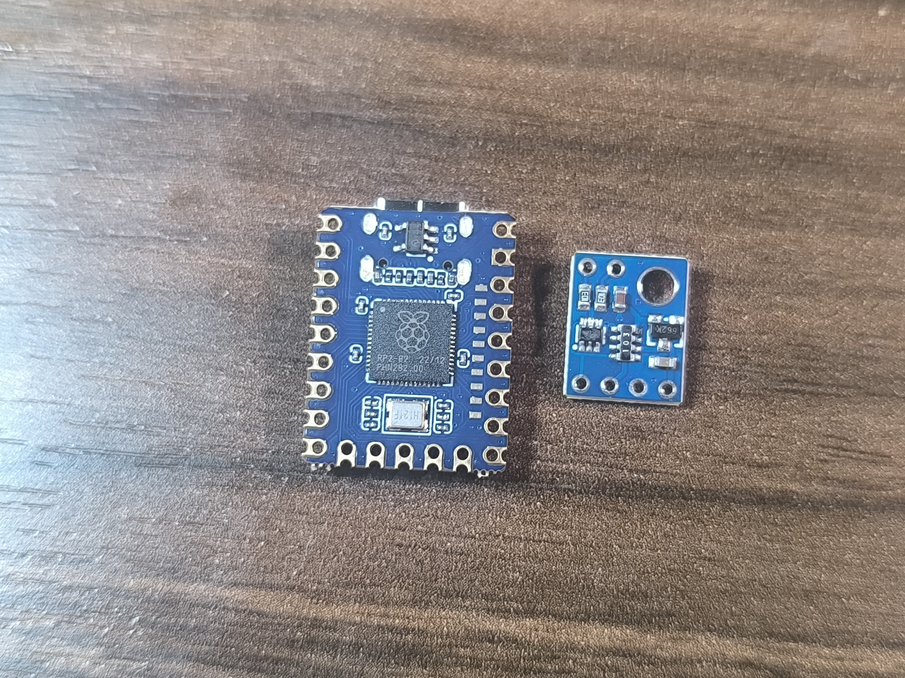

# Hardware v2 — received-module specification

This is the single detailed record for the physical modules currently used by
E003. It complements the product-level [Hardware v2 specification](../../research/hardware-v2-spec.md)
with evidence from the actual boards in hand.

## Evidence status

Two high-resolution, GPS-stripped photographs are stored in
[`evidence/photos/`](evidence/photos/). They establish visible labels and
orientation, but no ruler or caliper is present in the frame. Board dimensions,
pad pitch and pad offsets therefore remain pending measurement.

| Module | Observed | Still to verify |
| --- | --- | --- |
| Waveshare RP2040-Zero | `RP2040-Zero` silkscreen, USB-C, numbered GPIO pads, 5V/GND, BOOT/RESET controls | exact revision, outline, pad pitch/offset, USB keep-out and I2C pin choice |
| Blue `VL53LDK`-marked breakout | `VIN`, `GND`, `SCL`, `SDA` on one edge; `X` and `e` on the opposite edge; optical sensor package and corner hole | exact silicon identity, regulator/level shifting, pull-ups, outline, optical keep-out and pitch |

*Labels and connector view. The photo is evidence of visible markings only; it is not a scale reference.*

*Component-side view. Exact footprints and electrical behavior remain unverified.*

## Intended v2 interface

The carrier connects USB power and the sensor's I2C interface to the RP2040-Zero.
The desktop protocol remains USB Serial with JSON Lines; the carrier adds no
motor control, relays or mains circuitry.

| Signal | Candidate source | Candidate destination | Status |
| --- | --- | --- | --- |
| 3V3 / sensor supply | RP2040 3V3 rail | breakout VIN/3V3 | blocked until breakout power path is measured |
| GND | RP2040 GND | breakout GND | labels visible; pad positions pending measurement |
| SDA | RP2040 I2C0 candidate (GP4) | breakout SDA | candidate; confirm against board pinout |
| SCL | RP2040 I2C0 candidate (GP5) | breakout SCL | candidate; confirm against board pinout |

The breakout's two opposite-edge pads marked `X` and `e` are visible in the
received photo but their function is unresolved. They are shown in the carrier
review render as physical pads and explicitly left unconnected; they must not
be routed until continuity and a module schematic identify them.

No pull-up resistor or level translator is specified yet. The breakout must be
inspected electrically before those parts are selected.

## Internet cross-check (2026-09-01)

The supplied photo is a strong visual match for the mass-produced GY-530-style
board sold under names such as `VL53LDK`, `UL53LDK` and `GY-530 VL53L0X`: blue
rectangular PCB, one large corner mounting hole, central ToF package, and the
same four edge labels `VIN`, `GND`, `SCL`, `SDA`. Multiple vendor listings give
the recurring mechanical envelope as **10.5 × 13.3 mm** with a **3 mm mounting
hole** and quote a **2.8–5 V** input plus I²C. These are vendor claims, not a
substitute for measuring this received board. The `VL53LDK` label is not an
official ST product number; ST describes VL53LDK as a third-party technology
name, so the actual silicon should not be frozen as `VL53L0X` without an
electrical or datasheet-level confirmation.

The owner confirms that this GY-530-style distance-meter identification matches
the received module. That closes the visual product-family match; it does not
yet prove the silicon revision, regulator/level-shifter topology or exact hole
and pad coordinates.

The label glyph in the supplied photo can be read as `UL53LDK` (often advertised
as `VL53LDK`). Neither is an official ST ordering code. ST's community guidance
says this marketplace technology embeds an ST ToF sensor, and one ST moderator
describes it as based on the VL53L1X; other sellers describe the same blue family
as VL53L0X. Treat **VL53L1X/VL53L0X as competing hypotheses**, not as identified
silicon.

JLCPCB has two relevant Waveshare **sensor-module records**: `VL53L0X Distance
Sensor` (C431944) and `VL53L1X Distance Sensor` (C431945). Both expose an
EasyEDA footprint/symbol and are marked for JLCPCB SMT assembly; the pages also
say that purchased parts are kept in the JLCPCB parts library and cannot be
shipped separately. In other words, these are assembly/CAD records, not proof
that JLCPCB will retail the same loose blue module to us. JLCPCB also lists bare
ST sensor ICs such as `VL53L0X` (LGA-12, C2929940) and `VL53L1X` (LGA-12,
C2924337). None of these catalogue entries identifies the die mounted on the
received module.

On the component-side photograph, the three-pin device marked approximately
`662K` is consistent with a small LDO regulator. The exact manufacturer and
fixed output voltage are unknown: different 662K-family parts use the same
short marking, and the photo does not reveal the output code. Common GY-530
designs use a 2.8 V rail and may include I²C level shifting, but this four-pad
variant must be measured before either claim is used in the carrier schematic.

The RP2040 board is a strong visual match for the **Waveshare RP2040-Zero**:
the official drawing specifies **18.00 × 23.50 mm**, **2.54 mm edge pitch**, the
same USB-C/BOOT/RESET arrangement and the same numbered edge pads. I found a
second, independent KiCad footprint by `dj505`; its author labels it
**untested** and says the pin numbers are partly arbitrary, so it is useful as
an independent geometry check, not as a fabrication-ready pinout. The
manufacturer-linked EasyEDA/JLCPCB part page is the better CAD lead to export
and compare against the official drawing. The photo still cannot prove genuine
Waveshare manufacture versus a compatible clone.

### Fit assessment

| Candidate package found online | Geometry reported online | Match against supplied photo | Working decision |
| --- | --- | --- | --- |
| Waveshare RP2040-Zero | 18.00 × 23.50 mm; 2.54 mm edge pitch; numbered edge pads; USB-C, BOOT and RESET | **Strong visual match**: same outline, pad numbering pattern and control placement | Keep as provisional footprint reference; verify every edge coordinate on the received board |
| JLCPCB/EasyEDA Waveshare RP2040-Zero resource | Manufacturer-linked CAD resource for the named part | **Likely strongest package lead**, but the exported footprint still needs an overlay against the official drawing and the received board | Export the CAD package for review; do not freeze until pad numbering, outline and USB keep-out agree |
| `dj505/RP2040-Zero-KiCAD` | Independent KiCad footprint; 2.54 mm edge pitch and 23-pin SMD/THT pad layout | **Useful second opinion** on the general board envelope; author explicitly marks it untested and pin numbering arbitrary | Geometry cross-check only; never use its pin numbers as the electrical truth |
| GY-530-style `VL53LDK` board | 10.5 × 13.3 mm; one 3 mm corner hole; four labelled I²C/power pads on the lower edge and `X/e` auxiliary pads on the opposite edge | **Strong visual match**: same blue rectangle, corner hole, optical package and VIN/GND/SCL/SDA order | Keep as provisional mechanical envelope only; do not freeze chip, pull-ups, voltage path or X/e function |

### What the independent footprint actually contains

The `dj505` file is not just a symbol: it contains 23 numbered pads, duplicated
as through-hole and SMD landing geometry. Its edge-pad center rows are at
**x = 2.54 mm** and **x = 17.78 mm**, with **2.54 mm** vertical pitch; the
bottom row uses the same pitch. The nominal F.Fab body rectangle in that file is
about **18.16 × 23.88 mm**, versus **18.00 × 23.50 mm** in the Waveshare
drawing. That is close enough to explain the visual match, but the small
discrepancy plus the author's untested/arbitrary-pin warning means it must not
be used as-is for fabrication.

References: [Waveshare RP2040-Zero drawing](https://files.waveshare.com/upload/4/4c/RP2040_Zero.pdf),
[JLCPCB/EasyEDA RP2040-Zero CAD resource](https://jlcpcb.com/partdetail/Waveshare-RP2040Zero/C5350143),
[EasyEDA module page](https://easyeda.com/modules/RP2040-Zero_7b24158791074d248c4530b7d4e6639c),
[`dj505` independent KiCad footprint](https://github.com/dj505/RP2040-Zero-KiCAD),
[library index confirming the `dj505` package](https://pcbsync.com/kicad-raspberry-pi-library/),
[GY-530/VL53LDK listing](https://robocraze.com/products/robocraze-vl53ldk-time-of-flight-tof-lidar-laser-distance-sensor),
[same GY-530 family sold as VL53L0X](https://www.sunfounder.com/products/distance-measurement-sensor),
[ST note that VL53LDK is not an ST product](https://community.st.com/t5/imaging-sensors/vl53ldk-can-be-used-for-toys-6-age-and-pass-ul-ce-toys/td-p/247612),
[JLCPCB position-sensor catalogue](https://jlcpcb.com/parts/2nd/Sensors/Position_Sensors_2187),
[JLCPCB Waveshare VL53L0X module record C431944](https://jlcpcb.com/partdetail/Waveshare-VL53L0X_DistanceSensor/C431944),
[JLCPCB Waveshare VL53L1X module record C431945](https://jlcpcb.com/partdetail/Waveshare-VL53L1X_DistanceSensor/C431945),
[JLCPCB bare VL53L0X IC C2929940](https://jlcpcb.com/partdetail/-VL53L0X/C2929940),
[JLCPCB bare VL53L1X IC C2924337](https://jlcpcb.com/partdetail/STMicroelectronics-VL53L1X/C2924337),
[LDO family matching the `662K` marking](https://www.lcsc.com/product-detail/Linear-Voltage-Regulators-LDO_Shenzhen-Fuman-Elec-662K_C841298.html).

## Mechanical requirements

- USB-C and BOOT/RESET access remain usable after installation.
- The sensor optical path points downward and is unobstructed/cleanable.
- The two modules are soldered permanently to a two-layer carrier with strain
  relief; no loose jumper wires in the installed assembly.
- Final footprint and mounting-hole coordinates come from the ruler/caliper
  capture, not from this provisional document.

## Source evidence and next capture

See [`evidence.md`](evidence/evidence.md),
[`pin-truth-table.json`](evidence/pin-truth-table.json), and the
[`visual-fit-checklist.md`](visual-fit-checklist.md). Next required photos are
orthogonal ruler/caliper views of each board separately, plus side views of the
USB connector and sensor optical face.

The four candidate BOMs and their source confidence are in
[`variants/`](variants/README.md). Their generated proof renders are linked from
the [review portal variant matrix](review-portal/variants.html).
